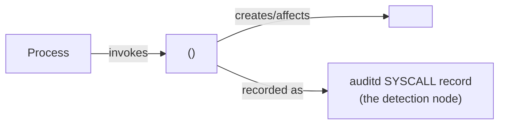

<!--
  TECHNIQUE RESEARCH REPORT — TEMPLATE
  Copy this file to research/trrNNNN/<platform>/README.md and fill it in.
  Keep the section order. Remove the HTML comments as you go.
  Write prose in Simplified Technical English (ASD-STE100) where practical.
  Keep technical names (syscalls, CVE IDs, ATT&CK IDs, kernel symbols) as-is.

  Procedure ID format: TRRID.PLATFORM.LETTER  (e.g. TRR0001.LIN.A)
  A procedure is a DISTINCT EXECUTION PATH. Same path, different tool or
  language = the SAME procedure.
-->

# <Specific, descriptive technique name>

## Metadata

| Key          | Value |
|--------------|-------|
| ID           | TRR0000 |
| External IDs | T#### (ATT&CK technique ID) |
| Tactics      | <tactic(s)> |
| Platforms    | <platform(s)> |
| Contributors | <name> |
| Status       | draft \| experimental \| reviewed |

<!-- Scope Statement (OPTIONAL): add only if this technique overlaps another
     framework entry and you need to state the boundary. -->

## Technique Overview

<!-- Plain language. A team lead with no deep technical background must be
     able to read this. What is the technique? Why does an adversary use it?
     Do NOT list execution steps here. Do NOT track specific threat actors. -->

## Technical Background

<!-- The foundations a reader needs before the procedures: the technologies,
     protocols, kernel interfaces, and security controls involved. Explain the
     mechanics and WHY the technique works and what control it defeats.
     Still no step-by-step execution. -->

## Procedures

<!-- A short reference table first, then one subsection per procedure. -->

| Procedure | ID | Name | Entry point |
|-----------|----|------|-------------|
| A | TRR0000.XXX.A | <name> | <syscall / API / primitive> |
| B | TRR0000.XXX.B | <name> | <syscall / API / primitive> |

### Procedure A: <name>  (`TRR0000.XXX.A`)

<!-- Narrative: prerequisites, mechanics, impact. What privileges are needed?
     What exactly runs? What is the observable result? Name the tools that use
     this same path (they are the same procedure). -->

#### Detection Data Model — `TRR0000.XXX.A`

<!-- The DDM is a graph. Nodes are telemetry events / objects. Edges are
     relations. Build it in the Arrows app (https://arrows.app), export the
     JSON to ddms/trr0000_xxx_a.json, and export a PNG to ddms/ or images/.
     You may ALSO inline a Mermaid version below so it renders on GitHub. -->

<!-- DDM summary: name the interesting nodes/edges. Which node is the best
     detection opportunity? Which sensor sees it (auditd, eBPF, EDR)? Is this
     node shared with other procedures (a chokepoint candidate)? -->

## Detection Strategy

<!-- THE KEY SECTION. Compare the DDMs. Find the invariant chokepoint that
     covers the most procedures. State the fallbacks.

     Strategy 1 (chokepoint): <what to key on> — covers procedures <A, B, ...>
       sensor: <auditd rule / eBPF>   rule: <path to Sigma rule>
     Strategy 2 (fallback):   <what to key on> — covers procedure <C>
       sensor: ...                    rule: ...

     Note enrichment signals that raise fidelity but are not required
     (for example a mode flag or a follow-on syscall). -->

## Available Emulation Tests

| Procedure | Test | Status |
|-----------|------|--------|
| A | [`atomics/T####/src/<file>.c`](../../../atomics/T####/) | built \| backlog |

## Detections

| Strategy | Covers | Sigma rule | Audit rule |
|----------|--------|------------|------------|
| 1 (chokepoint) | A, B | [`detections/sigma/T####/<file>.yml`](../../../detections/sigma/T####/) | `socket` in `atomic.rules` |

## References

<!-- Everything you read. man pages, CVE entries, write-ups, upstream docs. -->
- <reference>
