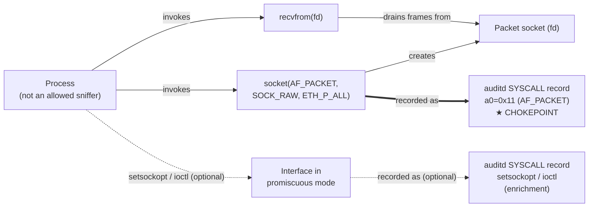
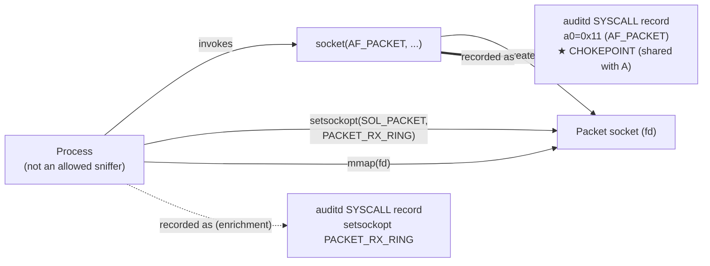
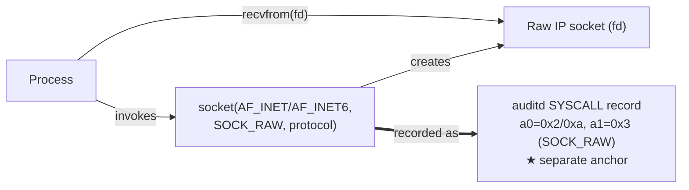
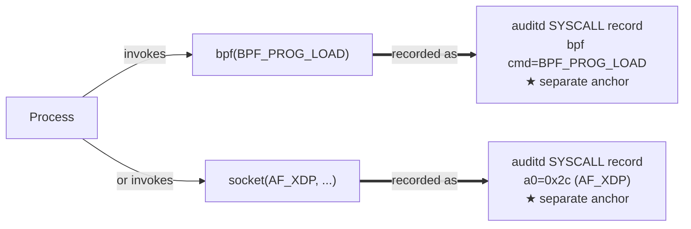

# Network Sniffing via Packet Capture (Linux)

> Prose uses Simplified Technical English (ASD-STE100) where practical.
> Syscall names, constants, CVE IDs, and ATT&CK IDs are technical names.

## Metadata

| Key          | Value |
|--------------|-------|
| ID           | TRR0001 |
| External IDs | T1040 |
| Tactics      | Credential Access, Discovery |
| Platforms    | Linux |
| Contributors | det-eng |
| Status       | experimental |

### Scope Statement

This TRR covers passive **packet capture on Linux hosts**: an adversary who
reads network frames or packets from a local interface. It does not cover
network taps on dedicated hardware, SPAN ports on switches, or man-in-the-
middle redirection (ARP/DNS spoofing); those are separate techniques that may
precede capture. ATT&CK T1040 also includes Windows and network-device
sniffing; this report is Linux only.

## Technique Overview

Network sniffing is the act of reading traffic that moves across a network.
An adversary on a Linux host can put an interface into a listening state and
copy the frames it sees. From those frames the adversary can read credentials,
tokens, and other data that applications send in clear text. The adversary can
also learn the layout of the network: which hosts talk to which, and on which
ports.

Sniffing is quiet. It sends nothing on the wire in its basic form, so the
network does not show the activity. The signal is on the host, in the system
calls that set up the capture. This report finds those calls and shows where
to detect them.

## Technical Background

To capture traffic, a program must ask the kernel for raw access to an
interface. Linux offers several interfaces for this. Each one has a different
entry point and a different capture mechanism, but all of them must cross the
kernel boundary with a system call. That system call is the telemetry.

**Packet sockets (`AF_PACKET`).** A packet socket gives a program link-layer
(Ethernet) frames. The program calls `socket(AF_PACKET, SOCK_RAW, ...)` for
full frames, or `SOCK_DGRAM` for frames with the link header removed. This is
the interface that `libpcap` uses, so it is the interface behind `tcpdump`,
`tshark`, `dumpcap`, and Wireshark, and behind most custom sniffers. A packet
socket needs the `CAP_NET_RAW` capability. The packet-socket ring code has
also been a repeated kernel privilege-escalation surface (CVE-2016-8655,
CVE-2017-7308), so this same entry point matters for T1068 as well.

**Raw IP sockets (`AF_INET` / `AF_INET6`).** A raw IP socket gives a program
packets at the IP layer, not full frames. The program calls
`socket(AF_INET, SOCK_RAW, protocol)`. This path cannot see the link header
and is less useful for broad sniffing, but it is a distinct capture path and
needs the same `CAP_NET_RAW`.

**eBPF and XDP.** A program can load an eBPF program with
`bpf(BPF_PROG_LOAD)` and attach it to an XDP or `tc` hook to copy frames to
user space. An `AF_XDP` socket (`socket(AF_XDP, ...)`) gives a fast
kernel-bypass path for the same goal. These are modern interfaces that many
host sensors do not watch.

**Promiscuous mode.** By default an interface passes up only frames addressed
to the host. To read every frame on the segment, the program puts the
interface in promiscuous mode. It does this with
`setsockopt(SOL_PACKET, PACKET_ADD_MEMBERSHIP, PACKET_MR_PROMISC)` or with
`ioctl(SIOCSIFFLAGS)` and the `IFF_PROMISC` flag. Promiscuous mode is a strong
secondary signal, but it is not required: a program can still capture the
host's own traffic without it.

**Why detection is on the host.** Passive capture sends no packets, so the
network has little to show. But every capture path above begins with a system
call that is rare on a normal server. That call, recorded by `auditd` or an
eBPF sensor, is the detection opportunity.

## Procedures

| ID | Title | Tactic | Entry point |
|----|-------|--------|-------------|
| TRR0001.LIN.A | Raw packet socket (classic receive) | Credential Access, Discovery | `socket(AF_PACKET, SOCK_RAW\|SOCK_DGRAM, ETH_P_ALL)` + `recvfrom()` |
| TRR0001.LIN.B | Packet socket with `PACKET_MMAP` ring | Credential Access, Discovery | `socket(AF_PACKET, ...)` + `setsockopt(PACKET_RX_RING)` + `mmap()` |
| TRR0001.LIN.C | Raw IP socket | Credential Access, Discovery | `socket(AF_INET\|AF_INET6, SOCK_RAW, protocol)` |
| TRR0001.LIN.D | eBPF / XDP frame capture | Credential Access, Discovery | `bpf(BPF_PROG_LOAD)` + XDP/`tc` attach, or `socket(AF_XDP, ...)` |

> Tool is not procedure. `tcpdump`, `tshark`, Wireshark/`dumpcap`, and a
> hand-written C sniffer all open an `AF_PACKET` socket. Modern `libpcap`
> defaults to the `PACKET_MMAP` ring. So those tools are Procedure A or
> Procedure B — not a procedure each.

### Procedure A: Raw packet socket (classic receive)  (`TRR0001.LIN.A`)

The program calls `socket(AF_PACKET, SOCK_RAW, htons(ETH_P_ALL))`. This gives
a descriptor that returns full Ethernet frames. The program then calls
`recvfrom()` (or `read()`) in a loop to pull frames into user space. It may
first put the interface in promiscuous mode to see all traffic on the segment.

- **Prerequisites:** `CAP_NET_RAW`. Without it the `socket()` call fails with
  `EPERM`, but the attempt is still a recorded system call.
- **Mechanics:** the kernel copies each matching frame to the socket receive
  queue; `recvfrom()` drains it.
- **Impact:** the adversary reads clear-text data and maps the network.
- **Tools on this path:** `tcpdump` (when the ring is not used), simple custom
  sniffers, `libpcap` fall-back mode.

#### Detection Data Model — `TRR0001.LIN.A`

Canonical graph: [`ddms/trr0001_lin_a.json`](ddms/trr0001_lin_a.json) (Arrows
app export). Inline view:



**DDM summary.** The strong node is the `socket()` event with `a0=0x11`
(the double arrow, marked ★). It is unavoidable: Procedure A cannot start
without it. The `recvfrom()` loop is high-volume and low-signal, so it is a
poor anchor. The promiscuous-mode node is high-fidelity but optional, so it is
an enrichment, not the primary anchor. The `socket()` node is shared with
Procedure B — this makes it a chokepoint candidate.

### Procedure B: Packet socket with `PACKET_MMAP` ring  (`TRR0001.LIN.B`)

The program opens the same `AF_PACKET` socket as Procedure A. It then sets up
a shared ring buffer: `setsockopt(SOL_PACKET, PACKET_RX_RING, ...)` (often
with `PACKET_VERSION` set to `TPACKET_V3`), and maps the ring with `mmap()`.
Frames then appear in the shared ring without a `recvfrom()` per frame, which
is far faster. This is the default mode of modern `libpcap`, so it is the path
behind a default `tcpdump`, `tshark`, and `dumpcap`.

- **Prerequisites:** `CAP_NET_RAW`.
- **Mechanics:** zero-copy capture through a memory-mapped ring.
- **Impact:** the same as Procedure A, but at line rate.

#### Detection Data Model — `TRR0001.LIN.B`



**DDM summary.** The same `socket(AF_PACKET, ...)` node starts this procedure.
This is the key finding: **A and B share one invariant node.** The
`PACKET_RX_RING` `setsockopt` is a good enrichment that separates ring capture
from classic capture, but it is not needed to detect the procedure — the
shared `socket()` node already covers it.

### Procedure C: Raw IP socket  (`TRR0001.LIN.C`)

The program calls `socket(AF_INET, SOCK_RAW, protocol)` (or `AF_INET6`). It
reads packets at the IP layer. This path does not see the link header and is
narrower than a packet socket, but it is a distinct execution path with its
own entry syscall.

- **Prerequisites:** `CAP_NET_RAW`.
- **Impact:** IP-layer capture; also used for packet crafting.
- **Note:** common benign users exist — `ping` and `traceroute` open raw IP
  sockets — so this path is noisier than `AF_PACKET`.

#### Detection Data Model — `TRR0001.LIN.C`



**DDM summary.** The anchor node is a **different** `socket()` event
(`a0=AF_INET/AF_INET6`, `a1=SOCK_RAW`). The `AF_PACKET` chokepoint does not
cover it, so Procedure C needs its own rule. The benign `ping`/`traceroute`
users mean this rule needs an allowlist and lower confidence.

### Procedure D: eBPF / XDP frame capture  (`TRR0001.LIN.D`)

The program loads an eBPF program with `bpf(BPF_PROG_LOAD)` and attaches it to
an XDP or `tc` hook that copies frames to user space, or it opens an `AF_XDP`
socket (`socket(AF_XDP, ...)`) for a kernel-bypass capture path. These are
modern interfaces. Many host sensors still do not watch them.

- **Prerequisites:** XDP/`tc` path — `CAP_BPF` **and** `CAP_NET_ADMIN`
  together (kernel >= 5.8; `CAP_SYS_ADMIN` on older kernels). `AF_XDP`-socket
  path — `CAP_NET_RAW`.
- **Impact:** high-speed capture that misses sensors hooked only on classic
  socket paths.

#### Detection Data Model — `TRR0001.LIN.D`



**DDM summary.** Two separate anchors, neither covered by the `AF_PACKET`
chokepoint. The `bpf(BPF_PROG_LOAD)` anchor is already modeled in this
repository under T1014. The `AF_XDP` socket is a new anchor.

## Detection Strategy

Read across the four DDMs. Procedures **A and B share one invariant node**:
the creation of an `AF_PACKET` socket. Procedures C and D each have their own
entry node. So the plan is one chokepoint rule plus two fallbacks.

**Strategy 1 — chokepoint (covers A + B).**
Key on the `socket()` syscall where domain `a0 = 0x11` (`AF_PACKET`, 17). A
process cannot capture link-layer frames without it, whatever tool or library
it uses. This single rule covers the great majority of real Linux sniffing:
`tcpdump`, `tshark`, Wireshark/`dumpcap`, and most custom and malicious
sniffers. This is the primary detection.
- Sensor: `auditd` `socket` rule (already in `atomic.rules`).
- Rule: `detections/sigma/T1040/afpacket_raw_socket.yml`.

**Strategy 2 — fallback (covers C).**
Key on the `socket()` syscall where `a0 ∈ {0x2 (AF_INET), 0xa (AF_INET6)}`
**and** the type carries `SOCK_RAW` (3) in its low bits. Do **not** match
`a1 = 0x3` exactly: the type may be OR'd with `SOCK_CLOEXEC` (`0x80000`) or
`SOCK_NONBLOCK` (`0x800`), so `SOCK_RAW|SOCK_CLOEXEC` logs `a1=0x80003`. Mask
the flag bits off — `(a1 & ~(SOCK_CLOEXEC|SOCK_NONBLOCK)) == 3` — or match the
low type bits, so the flagged variants still fire. This is a separate node
that Strategy 1 does not reach. Allowlist `ping` and `traceroute`, and set a
lower level.
- Status: **backlog** — rule not yet written.

**Strategy 3 — fallback (covers D).**
Key on `bpf()` with command `BPF_PROG_LOAD`, and on `socket()` where
`a0 = 0x2c` (`AF_XDP`, 44). The `bpf` half is already covered by
`detections/sigma/T1014/bpf_prog_load.yml`; cross-reference it from here. The
`AF_XDP` half is **backlog**.

**Enrichment (raises fidelity; not a primary anchor).**
Promiscuous-mode enable — `setsockopt(SOL_PACKET, PACKET_ADD_MEMBERSHIP,
PACKET_MR_PROMISC)` or `ioctl(SIOCSIFFLAGS)` with `IFF_PROMISC` — strongly
suggests wide capture. Correlate it with a Strategy 1 or 2 hit to raise
confidence. Today `atomic.rules` does not record `setsockopt`/`ioctl`; add
those syscalls to the ruleset to make this enrichment visible.

**Telemetry caveats.**
These strategies assume the modern direct `socket(2)` syscall. Scope the
audit rules to both architectures (`-F arch=b64` and `-F arch=b32`) so a
32-bit process is still recorded. On legacy i386 systems that route socket
creation through the `socketcall(2)` multiplexer, `auditd` records
`syscall=socketcall` with `a0=SYS_SOCKET` and a pointer in `a1` — not
`a0=domain` — so a `socket` + `a0` match never fires there; add a separate
`socketcall` rule or scope the detection to modern direct-syscall hosts.

**Coverage summary.**

| Procedure | Covered by | How |
|-----------|-----------|-----|
| A | Strategy 1 (chokepoint) | shared `AF_PACKET` socket node |
| B | Strategy 1 (chokepoint) | shared `AF_PACKET` socket node |
| C | Strategy 2 (fallback)   | distinct `AF_INET` raw socket node |
| D | Strategy 3 (fallback)   | distinct `bpf` / `AF_XDP` nodes |

One rule covers two of the four procedures — and those two are the common,
high-value paths. The fallbacks cover the rest. This is the goal of the
method: detect at the chokepoint first, then fill the gaps.

## Available Emulation Tests

| ID | Test | Status |
|----|------|--------|
| TRR0001.LIN.A | [`atomics/T1040/src/afpacket_rawsocket_behavioral.c`](../../../atomics/T1040/) | **built** |
| TRR0001.LIN.B | `PACKET_RX_RING` ring-setup behavioral | backlog |
| TRR0001.LIN.C | `AF_INET`/`AF_INET6` `SOCK_RAW` behavioral | backlog |
| TRR0001.LIN.D | eBPF: [`atomics/T1014/src/ebpf_prog_load_behavioral.c`](../../../atomics/T1014/) (the `bpf` half); `AF_XDP` socket behavioral | partial |

## Detections

| Strategy | Covers | Sigma rule | Audit rule |
|----------|--------|------------|------------|
| 1 (chokepoint) | A, B | [`detections/sigma/T1040/afpacket_raw_socket.yml`](../../../detections/sigma/T1040/afpacket_raw_socket.yml) | `socket` in [`atomic.rules`](../../../detections/audit/atomic.rules) |
| 2 (fallback) | C | backlog (`AF_INET` raw) | `socket` in `atomic.rules` |
| 3 (fallback) | D | [`detections/sigma/T1014/bpf_prog_load.yml`](../../../detections/sigma/T1014/bpf_prog_load.yml) (bpf half); `AF_XDP` backlog | `bpf` in `atomic.rules`; `socket` for `AF_XDP` |

Prove the loop (Procedure A is wired into the validator today):

```
sudo python3 detections/validate_detections.py           # real: atomic -> telemetry -> rule
python3 detections/validate_detections.py --dry-run       # compile + parse only
```

## References

- `packet(7)` — Linux packet socket interface:
  https://man7.org/linux/man-pages/man7/packet.7.html
- `socket(2)`, `raw(7)` — raw IP sockets.
- `bpf(2)`, AF_XDP / XDP — https://www.kernel.org/doc/html/latest/networking/af_xdp.html
- CVE-2016-8655 — `AF_PACKET` race: https://nvd.nist.gov/vuln/detail/CVE-2016-8655
- CVE-2017-7308 — `AF_PACKET` ring overflow: https://nvd.nist.gov/vuln/detail/CVE-2017-7308
- MITRE ATT&CK T1040 — Network Sniffing: https://attack.mitre.org/techniques/T1040/
- TRR method — https://github.com/tired-labs/techniques/blob/main/docs/TECHNIQUE-RESEARCH-REPORT.md
