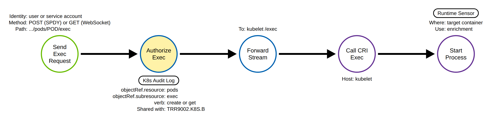
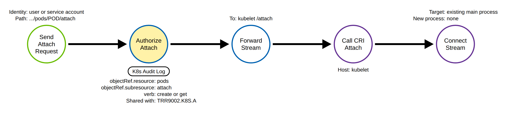
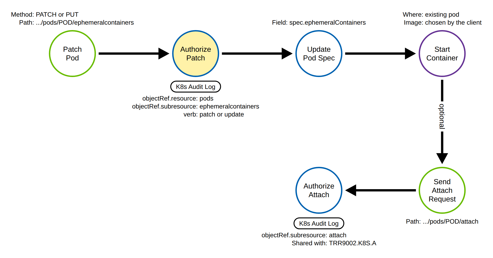
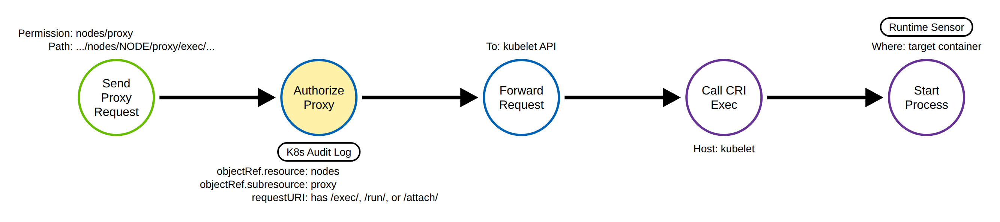
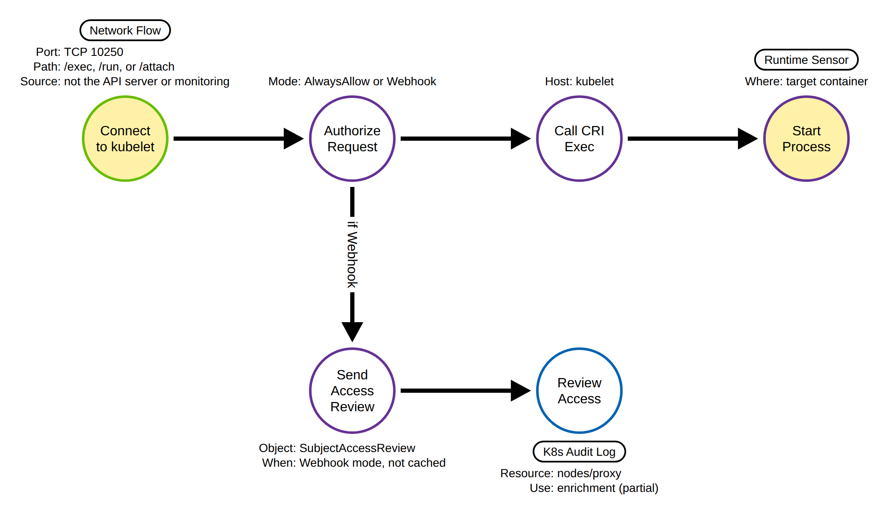

# Command Execution in a Running Container (Kubernetes)

> Prose uses Simplified Technical English (ASD-STE100) where practical.
> API paths, resource names, field names, and ATT&CK IDs are technical names.

## Metadata

| Key          | Value |
|--------------|-------|
| ID           | TRR9002 |
| External IDs | T1609 |
| Tactics      | Execution |
| Platforms    | Kubernetes |
| Contributors | det-eng |
| Status       | draft |

### Scope Statement

This TRR covers command execution inside a running container through the
Kubernetes control interfaces: the API server and the kubelet.

This TRR does not cover these related actions:

- A command that goes directly to a container runtime on a node, for example
  `crictl exec` or `docker exec` through a runtime socket. The Kubernetes
  control interfaces do not see these commands. A Linux or Docker TRR must
  cover them.
- A new workload that runs adversary code. ATT&CK T1610 (Deploy Container)
  covers this.
- An escape from a container to its node. ATT&CK T1611 (Escape to Host)
  covers this.
- A port forward to a container (`pods/portforward`). It opens a network
  tunnel. It does not run a command.

An ephemeral debug container is in scope. It does not create a new workload.
It runs inside an existing pod, and Kubernetes provides it as a feature to
examine that pod.

ATT&CK T1609 also includes the Docker daemon. This report covers Kubernetes
only.

## Technique Overview

Kubernetes runs applications in containers. An administrator can run a
command inside a running container, or open an interactive shell in it. The
`kubectl exec` command does this. Administrators use it to examine and repair
live applications.

An adversary can use the same feature. The adversary needs credentials that
have the necessary permission. With those credentials, the adversary can run
commands in each container that the credentials can reach. The command runs
with the identity and the access of that container. The adversary can then
read the application's files, secrets, and network. The adversary does not
need to deploy new software or change the application.

This technique uses a legitimate administration feature. Each request looks
like normal administration work. The differences are in who sends the
request, from which location, and into which container. This report
identifies the paths that lead to command execution in a container. It shows
where the cluster records each path, and which records give a detection
opportunity.

## Technical Background

### The exec path

A request to run a command in a container goes through four components:

1. A client sends the request to the API server. The request targets a
   subresource of the pod: `pods/exec`.
2. The API server authenticates the client and checks authorization. It also
   writes an audit event.
3. The API server forwards the request to the kubelet on the node that runs
   the pod.
4. The kubelet tells the container runtime to start the command in the
   container. The runtime starts a new process in the namespaces and cgroups
   of that container.

The new process gets the filesystem, the network, and the environment of the
container. It can also read the service account token, if the pod mounts one.
It does not get more privilege than the container has.

### Streaming subresources and the two protocols

Exec and attach are streaming subresources. The connection changes from a
normal HTTP request to a two-way stream for standard input, standard output,
and standard error. Kubernetes supports two stream protocols:

- **SPDY/3.1.** The client sends an HTTP `POST` and upgrades the connection.
- **WebSocket.** The client sends an HTTP `GET` with an upgrade header.

Since v1.31, `kubectl` uses WebSocket by default. It uses SPDY only when the
server does not support WebSocket. Other clients can use either protocol.

### How the protocol changes the audit record

The API server gets the verb from the HTTP method. `POST` becomes `create`.
`GET` becomes `get`. So the audit log records an exec over SPDY with
`verb: create`, and an exec over WebSocket with `verb: get`. A rule that
matches only `verb: create` does not see an exec from a current `kubectl`.

### Authorization

RBAC controls exec with the `create` verb on `pods/exec`. The built-in `edit`
and `admin` cluster roles include this permission.

Before v1.35, the API server checked only the verb that came from the HTTP
method. So `get` permission on `pods/exec` was enough for an exec over
WebSocket. Kubernetes v1.35 added the
`AuthorizePodWebsocketUpgradeCreatePermission` feature gate. It is beta and
on by default. It adds a second check for `create` on `pods/exec`,
`pods/attach`, and `pods/portforward`. The gate changes the permission check.
It does not change the verb in the audit record. A WebSocket exec still
appears as `verb: get`.

### The kubelet API

Each kubelet serves its own HTTPS API. The default port is TCP 10250. The API
server uses this API to forward exec requests. The kubelet API also accepts
requests directly from other clients. It has `/exec`, `/run`, and `/attach`
endpoints. The `/run` endpoint runs one command and returns its output.

The kubelet does its own authentication and authorization:

- **Defaults.** The kubelet binary accepts anonymous requests by default. Its
  default authorization mode is `AlwaysAllow`. Most install tools and managed
  services change these settings. Examine the settings on each cluster.
- **Webhook mode.** The kubelet sends a `SubjectAccessReview` to the API
  server to authorize a request. It keeps the result in a cache for a short
  time. The kubelet maps the `/exec`, `/run`, and `/attach` endpoints to the
  `nodes/proxy` subresource. It gets the verb from the HTTP method.
- **The `nodes/proxy` problem.** A WebSocket connection starts with `GET`. So
  `get` permission on `nodes/proxy` is enough to run a command through the
  kubelet. The Kubernetes documentation warns that this permission is not
  read-only. Many monitoring tools ask for `nodes/proxy` to read metrics. The
  Kubernetes Security Team considers this behavior to be as designed.

The API server does not record a direct kubelet request as an exec. At most,
it records the `SubjectAccessReview` that the kubelet sends.

### The node proxy

The API server also has a `nodes/proxy` subresource. It forwards a request to
a path on the kubelet API. A request through this proxy can reach the kubelet
`/exec`, `/run`, and `/attach` endpoints. The audit record for this request
shows `nodes/proxy`, not `pods/exec`.

### Ephemeral containers

An ephemeral container is a temporary container that a user adds to a running
pod. Its purpose is to examine a pod that has no shell or tools. The
`kubectl debug` command sends a `PATCH` to the `pods/ephemeralcontainers`
subresource to add one. It then attaches to the new container. An ephemeral
container can share the process namespace of a target container. Then it can
see the processes of that container and their files. The pod keeps a record of
each ephemeral container in `spec.ephemeralContainers`.

### The audit log

The API server writes audit events as its audit policy specifies. The policy
sets a level for each type of request: `None`, `Metadata`, `Request`, or
`RequestResponse`. The `Metadata` level is sufficient for most of this
technique. A `Metadata` event has these fields:

| Field | Meaning |
|-------|---------|
| `user.username`, `user.groups` | The identity that sent the request |
| `sourceIPs` | The client address |
| `userAgent` | The client program, for example `kubectl/v1.34.1` |
| `verb` | `create`, `get`, `patch`, and others |
| `objectRef.resource`, `objectRef.subresource` | For example `pods` and `exec` |
| `objectRef.namespace`, `objectRef.name` | The target pod or node |
| `requestURI` | The full path. For exec, it has the command and the container name as query parameters. |
| `responseStatus.code` | The result. `403` shows a request that authorization refused. |

Exec is a long-running request. The API server can write one event at each
stage: `RequestReceived`, `ResponseStarted`, and `ResponseComplete`. All
events for one request have the same `auditID`. Use `auditID` to remove
duplicates.

The API server does not write audit events until an administrator sets an
audit policy. Managed services have different settings. Make sure that the
audit log gets to the SIEM.

### Why the technique works

Exec is a normal administration feature. The cluster cannot tell a good exec
from a bad one. Authorization is the only control. A detection must use
context: who sent the request, from where, with which client, into which
container, and with which command.

## Procedures

| ID | Title | Tactic | Entry point |
|----|-------|--------|-------------|
| TRR9002.K8S.A | Exec through the API server | Execution | `pods/exec` (verb `create` or `get`) |
| TRR9002.K8S.B | Attach through the API server | Execution | `pods/attach` (verb `create` or `get`) |
| TRR9002.K8S.C | Ephemeral debug container | Execution | `pods/ephemeralcontainers` (verb `patch` or `update`) |
| TRR9002.K8S.D | Exec through the API server node proxy | Execution | `nodes/proxy` to kubelet `/exec`, `/run`, or `/attach` |
| TRR9002.K8S.E | Exec directly through the kubelet API | Execution | kubelet API on TCP 10250: `/exec`, `/run`, or `/attach` |

> A tool is not a procedure. `kubectl exec`, `client-go`, the Python client,
> k9s, Lens, and web terminals all send a `pods/exec` request. They are all
> Procedure A. The protocol (SPDY or WebSocket) changes the verb in the audit
> record. It does not change the path.

**Reading the DDMs.** Each DDM is a PNG in the style of the
`tired-labs/techniques` reports, rendered from the Arrows app JSON beside it.
Green borders are operations the client performs. Blue borders are
operations the API server performs. Purple borders are operations on the
node: the kubelet and the container runtime. The pill on a node names the
telemetry that records it, and the `Key: value` lines are the details a rule
can match. A shaded node is a primary detection opportunity.

### Procedure A: Exec through the API server  (`TRR9002.K8S.A`)

The client sends an exec request for one container in one pod. The API server
checks authorization, writes an audit event, and forwards the stream to the
kubelet. The kubelet tells the container runtime to start the command in the
container.

- **Prerequisites:** permission to `create` on `pods/exec` in the namespace of
  the pod. Before v1.35, or when the feature gate is off, `get` is enough for
  a WebSocket client.
- **Mechanics:** a new process starts inside the target container. With a
  terminal (`tty=true`) and standard input (`stdin=true`), the client gets an
  interactive shell.
- **Impact:** the adversary runs commands as the container. The adversary can
  read the container's files, environment variables, secrets, and service
  account token, and can use its network access.
- **Tools on this path:** `kubectl exec`, client libraries, k9s, Lens,
  dashboards, and web terminals.

#### Detection Data Model — `TRR9002.K8S.A`

Source: [`ddms/trr9002_k8s_a.json`](ddms/trr9002_k8s_a.json) (Arrows app format).

**DDM summary.** The audit event for `pods/exec` is the primary detection
opportunity (*Authorize Exec*, shaded). The API server writes it before the command
starts. The client cannot avoid it, because the API server is the only path
to the kubelet in this procedure. The event has the identity, the client
address, the client program, the target pod, and the command. The `verb`
field is `create` for SPDY and `get` for WebSocket. A rule must accept both.
A node runtime sensor can also see the new process. That event confirms the
exec, but it is not necessary for detection.

### Procedure B: Attach through the API server  (`TRR9002.K8S.B`)

The client attaches to the main process of a running container. It does not
start a new process. It connects to the standard input and output of the
process that is already there.

- **Prerequisites:** permission to `create` on `pods/attach`. The container
  must keep standard input open (`stdin: true` in the pod spec). Command
  execution is possible only when the main process reads commands, for
  example a shell or an interpreter.
- **Mechanics:** the kubelet tells the runtime to connect the stream to the
  existing process.
- **Impact:** the same as Procedure A, but only for containers with an
  interactive main process. This is rare in production.
- **Tools on this path:** `kubectl attach`, `kubectl run -it`, and the
  attach step of `kubectl debug`.

#### Detection Data Model — `TRR9002.K8S.B`

Source: [`ddms/trr9002_k8s_b.json`](ddms/trr9002_k8s_b.json) (Arrows app format).

**DDM summary.** The anchor is the same type of audit event as Procedure A.
Only the subresource is different: `attach`, not `exec`. One rule can match
both subresources. A node runtime sensor sees no new process for this
procedure, so the audit event is the only good detection opportunity.

### Procedure C: Ephemeral debug container  (`TRR9002.K8S.C`)

The client adds an ephemeral container to a running pod. The client chooses
the image and the command. The new container can share the process namespace
of a target container in the pod. The client then attaches to the new
container, or reads its output from the container log.

- **Prerequisites:** permission to `patch` or `update` on
  `pods/ephemeralcontainers`. To attach, permission on `pods/attach`.
- **Mechanics:** the API server adds the container to
  `spec.ephemeralContainers`. The kubelet starts it in the existing pod.
- **Impact:** the adversary runs a chosen image with its own tools in the
  pod. The image does not need a shell. With a shared process namespace, the
  adversary can see the target container's processes and their files.
- **Tools on this path:** `kubectl debug`, and any client that changes the
  `ephemeralcontainers` subresource.

#### Detection Data Model — `TRR9002.K8S.C`

Source: [`ddms/trr9002_k8s_c.json`](ddms/trr9002_k8s_c.json) (Arrows app format).

**DDM summary.** This procedure has its own anchor: a `patch` or `update` on
`pods/ephemeralcontainers`. The adversary cannot add the container without
it. The attach step reaches the Procedure A chokepoint, but it is optional.
The adversary can read the output from the container log and not attach. So
Procedure C needs its own rule.

### Procedure D: Exec through the API server node proxy  (`TRR9002.K8S.D`)

The client sends a request to the `nodes/proxy` subresource of the API
server. The path of the request points to the kubelet `/exec`, `/run`, or
`/attach` endpoint. The API server forwards the request to the kubelet. The
kubelet runs the command in the container.

- **Prerequisites:** permission on `nodes/proxy`. For a WebSocket request,
  `get` is enough. Many monitoring service accounts have this permission.
- **Mechanics:** the same kubelet endpoints as Procedure E, but through the
  API server.
- **Impact:** command execution in any container on the node, including
  system pods. Authorization does not check `pods/exec`.
- **Tools on this path:** any HTTP or WebSocket client with API server
  credentials.

#### Detection Data Model — `TRR9002.K8S.D`

Source: [`ddms/trr9002_k8s_d.json`](ddms/trr9002_k8s_d.json) (Arrows app format).

**DDM summary.** The audit event shows `nodes/proxy`, not `pods/exec`. So the
Procedure A rule does not see it. The anchor is the combination of the
`nodes/proxy` subresource and an exec path in `requestURI`. The subresource
alone is not sufficient. Monitoring tools use `nodes/proxy` every few seconds
to read `/metrics` and `/stats`. The path separates exec from that normal
traffic.

### Procedure E: Exec directly through the kubelet API  (`TRR9002.K8S.E`)

The client connects to the kubelet API on a node and does not use the API
server. The client sends a request to the `/exec`, `/run`, or `/attach`
endpoint. The kubelet authorizes the request and runs the command in the
container.

- **Prerequisites:** network access to TCP 10250 on a node. The client also
  needs one of these:
  - Anonymous access, if the kubelet allows anonymous requests and uses
    `AlwaysAllow` authorization.
  - A credential that the kubelet accepts, with permission on `nodes/proxy`.
    For a WebSocket request, `get` is enough.
- **Mechanics:** the kubelet maps the endpoint to `nodes/proxy`. In Webhook
  mode, it sends a `SubjectAccessReview` to the API server, unless the result
  is already in its cache.
- **Impact:** command execution in any container on the node. The API server
  audit log does not record the exec.
- **Tools on this path:** any HTTP or WebSocket client.

#### Detection Data Model — `TRR9002.K8S.E`

Source: [`ddms/trr9002_k8s_e.json`](ddms/trr9002_k8s_e.json) (Arrows app format).

**DDM summary.** This procedure does not go through the API server, so the
audit log rules for Procedures A to D do not see it. Two anchors remain. The
first is on the node: the runtime starts a new process in an existing
container. A runtime sensor or an EDR agent with container context sees this.
The second is on the network. It is a connection to port 10250 from an
unexpected source. The API server and approved monitoring tools are the
expected sources. The
`SubjectAccessReview` is a weak signal. The kubelet sends it only when the
result is not in its cache. The `Metadata` audit level does not show what the
review asked for. Use it as enrichment only.

## Detection Strategy

Compare the five DDMs. Procedures A to D all go through the API server, so
each one leaves an audit event. Procedures A and B share one anchor: an audit
event for a streaming subresource of a pod. Procedures C and D each have a
different audit anchor. Procedure E does not go through the API server. Its
anchors are on the node and on the network.

So the plan has four parts. One chokepoint rule on the audit log covers A and
B. Two more audit log rules cover C and D. One node rule covers E, the path
that avoids the API server.

**Telemetry requirement.** Strategies 1 to 3 need the API server audit log.
The audit policy must record `pods/exec`, `pods/attach`,
`pods/ephemeralcontainers`, and `nodes/proxy` at the `Metadata` level or
higher. Do not let a rule for a noisy group, for example `nodes`, set these
subresources to `None`.

**Strategy 1 — chokepoint (covers A and B, and the attach step of C).**
Match audit events where `objectRef.resource` is `pods` and
`objectRef.subresource` is `exec` or `attach`. **Do not filter on `verb`.**
SPDY clients appear as `create`. WebSocket clients appear as `get`. Since
v1.31, `kubectl` uses WebSocket by default. The SigmaHQ rule
`kubernetes_audit_exec_into_container.yml` matches only `verb: create`, so it
does not detect an exec from a current `kubectl`. Each exec makes up to three
events, one for each stage. Count one event for each `auditID`.

- Sensor: API server audit log.
- Rule: `detections/sigma/T1609/k8s_pod_exec_attach.yml` (built).

**Strategy 2 — fallback (covers C).**
Match audit events where `objectRef.resource` is `pods`,
`objectRef.subresource` is `ephemeralcontainers`, and `verb` is `patch` or
`update`. Ephemeral containers are rare in production, so this rule is
low-noise. The attach step of `kubectl debug` also triggers Strategy 1.
Correlate the two events on the pod name for a stronger signal.

- Sensor: API server audit log.
- Rule: `detections/sigma/T1609/k8s_pod_ephemeral_container.yml` (built).

**Strategy 3 — fallback (covers D).**
Match audit events where `objectRef.resource` is `nodes`,
`objectRef.subresource` is `proxy`, and `requestURI` contains `/exec/`,
`/run/`, or `/attach/`. Do not match on the subresource alone. Monitoring
tools read `/metrics` and `/stats` through `nodes/proxy` all the time. An
exec path through the node proxy is very rare, so set a high level.

- Sensor: API server audit log.
- Rule: `detections/sigma/T1609/k8s_node_proxy_exec.yml` (built).

**Strategy 4 — fallback (covers E; confirms A and D).**
All exec paths end at the container runtime. The runtime starts a new process
in an existing container. A node sensor with container context can see this
event, for example a runtime security agent or an EDR agent. The event is the
only strong anchor for Procedure E. It also confirms Procedures A and D. Exec
probes in a pod spec also run commands in containers on a schedule. Exclude
commands that match a probe in the spec of that pod. A Procedure E exec has
no matching audit event, so correlate with Strategies 1 and 3. A node exec
with no audit event in the same time window is a strong signal.

- Sensor: a runtime security agent or an EDR agent on each node.
- Rule: none at the audit-log layer, by design. The signal depends on the
  sensor, and Sigma has no common log source for a container runtime exec
  event. The `emulate.sh e` test documents the gap: it shows a direct kubelet
  call leaves no API server audit event.

**Network fallback for E.**
Alert on connections to TCP 10250 on nodes from sources other than the
control plane and approved monitoring tools. This needs network flow logs
from inside the cluster, for example from the CNI. The signal is not specific
to exec. It also shows reconnaissance against the kubelet.

**Enrichment (raises fidelity; not a primary anchor).**

- **Identity.** An exec from a service account
  (`system:serviceaccount:...`) is unusual unless a known operator or a CI
  system sends it. An exec from an identity that has not used exec before is
  also unusual.
- **Client.** `userAgent` is not `kubectl`, a known dashboard, or a known
  operator. For example, a scripting library or a command-line HTTP client.
- **Source address.** `sourceIPs` is a pod address or an address outside the
  administration network.
- **Target.** The namespace is `kube-system` or another system namespace. The
  pod runs with privilege, or it has a powerful service account.
- **Command.** `requestURI` has `tty=true` and `stdin=true` (an interactive
  shell). Or the command names a shell, a download tool, or the service
  account token path.
- **Refused attempts.** `responseStatus.code` is `403`. Many refused exec
  requests from one identity show that the identity is testing its
  permissions.

**Coverage summary.**

| Procedure | Covered by | How |
|-----------|-----------|-----|
| A | Strategy 1 (chokepoint) | `pods/exec` audit event, any verb |
| B | Strategy 1 (chokepoint) | `pods/attach` audit event, any verb |
| C | Strategy 2 (fallback); Strategy 1 if it attaches | `pods/ephemeralcontainers` audit event |
| D | Strategy 3 (fallback); Strategy 4 confirms | `nodes/proxy` audit event with an exec path |
| E | Strategy 4 (fallback); network fallback | node runtime event with no audit event |

One audit log rule covers the two most common procedures. Two more audit log
rules cover the less common API server paths. A node sensor covers the path
that avoids the API server.

## Available Emulation Tests

The tests run in a lab cluster with an audit policy that records the
subresources above. The lab is a `kind` cluster; its config and audit policy
are in [`detections/k8s/`](../../../detections/k8s/). Each test runs the benign
command `id` through one control path. One script drives them all:
[`atomics/T1609/src/emulate.sh`](../../../atomics/T1609/src/emulate.sh), with an
Atomic Red Team wrapper in
[`atomics/T1609/T1609.yaml`](../../../atomics/T1609/T1609.yaml).

| ID | Test | Status |
|----|------|--------|
| TRR9002.K8S.A | `emulate.sh a` — `kubectl exec` with `id`, once over WebSocket and once over SPDY. Confirms the audit log shows `verb: get` and `verb: create`. | **built** |
| TRR9002.K8S.B | `emulate.sh b` — attach to the target pod with `kubectl attach`. | **built** |
| TRR9002.K8S.C | `emulate.sh c` — add an ephemeral container with `kubectl debug`. | **built** |
| TRR9002.K8S.D | `emulate.sh d` — run `id` through `nodes/proxy` to the kubelet `/run` endpoint. | **built** |
| TRR9002.K8S.E | `emulate.sh e` — call the kubelet directly (read-only), from inside the control-plane node. Shows the API server records no event. | **built** |

## Detections

| Strategy | Covers | Sigma rule | Sensor |
|----------|--------|------------|--------|
| 1 (chokepoint) | A, B, C (attach step) | [`detections/sigma/T1609/k8s_pod_exec_attach.yml`](../../../detections/sigma/T1609/k8s_pod_exec_attach.yml) | API server audit log |
| 2 (fallback) | C | [`detections/sigma/T1609/k8s_pod_ephemeral_container.yml`](../../../detections/sigma/T1609/k8s_pod_ephemeral_container.yml) | API server audit log |
| 3 (fallback) | D | [`detections/sigma/T1609/k8s_node_proxy_exec.yml`](../../../detections/sigma/T1609/k8s_node_proxy_exec.yml) | API server audit log |
| 4 (fallback) | E; confirms A, D | none; depends on the sensor | node runtime sensor |

The auditd validator (`detections/validate_detections.py`) replays syscall
atomics and cannot test these rules. The Kubernetes loop has its own validator,
[`detections/validate_k8s_detections.py`](../../../detections/validate_k8s_detections.py):
it reads the API server audit log the emulation produced and asserts each Sigma
rule above matches. The workflow
[`validate-k8s-detections.yml`](../../../.github/workflows/validate-k8s-detections.yml)
runs the whole loop on a `kind` cluster for every change to these files.

Strategy 4 (Procedure E) has no audit-log rule by design: a direct kubelet
request never reaches the API server, so the `emulate.sh e` test documents the
gap rather than feeding a rule. A node runtime sensor covers it.

Upstream: propose a change to the SigmaHQ rule
`kubernetes_audit_exec_into_container.yml` so that it matches `verb: get` as
well as `verb: create`.

## References

- MITRE ATT&CK, T1609 Container Administration Command:
  <https://attack.mitre.org/techniques/T1609/>
- Kubernetes documentation, Auditing (levels, stages, event fields):
  <https://kubernetes.io/docs/tasks/debug/debug-cluster/audit/>
- Kubernetes documentation, Kubelet authentication/authorization (defaults,
  endpoint to subresource map, `nodes/proxy` warning):
  <https://kubernetes.io/docs/reference/access-authn-authz/kubelet-authn-authz/>
- Kubernetes documentation, Ephemeral Containers:
  <https://kubernetes.io/docs/concepts/workloads/pods/ephemeral-containers/>
- Kubernetes blog, "Kubernetes 1.31: Streaming Transitions from SPDY to
  WebSockets":
  <https://kubernetes.io/blog/2024/08/20/websockets-transition/>
- KEP-4006, Transition from SPDY to WebSockets:
  <https://github.com/kubernetes/enhancements/issues/4006>
- Kubernetes issue #133515, the reason for the
  `AuthorizePodWebsocketUpgradeCreatePermission` feature gate:
  <https://github.com/kubernetes/kubernetes/issues/133515>
- Kubernetes source, HTTP method to verb map in the API server:
  <https://github.com/kubernetes/kubernetes/blob/master/staging/src/k8s.io/apiserver/pkg/endpoints/request/requestinfo.go>
- Kubernetes source, the `create` check for pod streaming subresources:
  <https://github.com/kubernetes/kubernetes/blob/master/pkg/registry/core/pod/rest/subresources.go>
- Kubernetes source, kubelet request attributes (endpoint to `nodes/proxy`):
  <https://github.com/kubernetes/kubernetes/blob/master/pkg/kubelet/server/auth.go>
- Kubernetes source, `kubectl debug` (`PATCH` to `ephemeralcontainers`):
  <https://github.com/kubernetes/kubernetes/blob/master/staging/src/k8s.io/kubectl/pkg/cmd/debug/debug.go>
- Graham Helton, `nodes/proxy` GET to command execution through the kubelet:
  <https://grahamhelton.com/blog/nodes-proxy-rce>
- SigmaHQ rule, Potential Remote Command Execution In Pod Container:
  <https://github.com/SigmaHQ/sigma/blob/master/rules/application/kubernetes/audit/kubernetes_audit_exec_into_container.yml>
- Elastic rule, Kubernetes User Exec into Pod (matches `get` and `create`):
  <https://www.elastic.co/guide/en/security/current/kubernetes-user-exec-into-pod.html>
- Microsoft Threat Matrix for Kubernetes, Exec into container:
  <https://microsoft.github.io/Threat-Matrix-for-Kubernetes/techniques/Exec%20into%20container/>
- TRR method:
  <https://github.com/tired-labs/techniques/blob/main/docs/TECHNIQUE-RESEARCH-REPORT.md>
