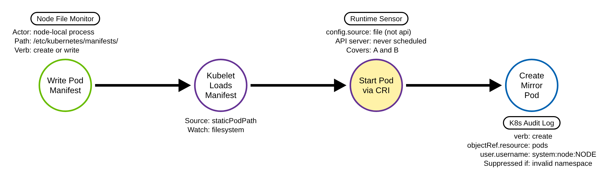
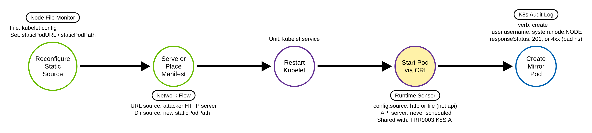

# Static Pod Persistence (Kubernetes)

> Prose uses Simplified Technical English (ASD-STE100) where practical.
> Config field names, file paths, annotation keys, and ATT&CK IDs are technical
> names.

## Metadata

| Key          | Value |
|--------------|-------|
| ID           | TRR9003 |
| External IDs | T1543.005 |
| Tactics      | Persistence |
| Platforms    | Kubernetes |
| Contributors | det-eng |
| Status       | draft |

### Scope Statement

This TRR covers persistence through **static pods**: pods that a kubelet runs
from a node-local manifest, or from a manifest URL, without the Kubernetes API
server. The kubelet reads the manifest and tells the container runtime to start
the pod. The API server does not schedule it, does not admit it, and does not
authorize it.

This TRR does not cover these related actions:

- A workload that the API server does schedule — a Deployment, a DaemonSet, or
  a bare pod — used for persistence. The API server records and admits these.
  They are normal API objects.
- A Kubernetes `CronJob` or `Job` used for persistence or execution. ATT&CK
  T1053.007 (Container Orchestration Job) covers that path, and the API server
  records it. (Some sensors tag static pods T1053.007 as well; this report uses
  T1543.005, because the kubelet is the node service that runs and re-runs the
  pod, which is the Create or Modify System Process idea.)
- A new workload that runs adversary code through the API server. ATT&CK T1610
  (Deploy Container) covers this.
- Command execution in a pod that already runs. ATT&CK T1609 covers this; it is
  TRR9002 in this repository.
- An escape from a container to its node. ATT&CK T1611 (Escape to Host) covers
  this. A static pod is often the *goal* of an escape (it needs node file
  access), but the escape itself is a different technique.

## Technique Overview

Kubernetes normally runs a pod only after the API server accepts it. A client
sends the pod to the API server. The API server authenticates the client,
checks authorization, runs admission control, and stores the pod. Then a
scheduler and a kubelet start it. Every step leaves a record.

A static pod skips all of that. Each kubelet can read pod manifests straight
from a directory on its node, or from a URL. For every manifest it finds, the
kubelet tells the container runtime to start the pod. The API server plays no
part. This is a normal feature: a cluster bootstraps its own control plane this
way, because the API server cannot schedule the API server.

An adversary who can write a file on a node can use the same feature. The
adversary writes one pod manifest into the directory the kubelet watches. The
kubelet starts the pod. The pod runs with whatever the manifest asks for, which
can include host mounts, the host network, and a privileged security context.
The kubelet restarts the pod if it stops, and again after the node reboots. The
adversary now has a foothold that does not depend on any API object and that
survives a restart.

The pod can also be hard to see. The kubelet normally registers a read-only
"mirror pod" in the API server so an administrator can list the static pod with
`kubectl`. If the manifest names a namespace that does not exist, the API server
rejects the mirror pod, so no pod object is stored and `kubectl get pods` cannot
see it. The static pod still runs on the node, where only a tool such as
`crictl` shows it. (The kubelet's rejected mirror-pod attempt is still written
to the audit log, as a failed request; what no record shows is the pod running.)

This technique uses a control path that the control plane does not see. A
detection cannot rely on the API server audit log alone. It must use a sensor on
the node.

## Technical Background

### What a static pod is

A kubelet takes pod definitions from more than one source. The API server is one
source. A node-local manifest is another. The kubelet configuration sets where
it looks:

- **`staticPodPath`** (kubelet config) or the older `--pod-manifest-path` flag
  names a directory. The kubelet reads every manifest in it and watches it for
  changes. On a `kubeadm` cluster the default is `/etc/kubernetes/manifests`.
- **`staticPodURL`** (kubelet config) or the older `--manifest-url` flag names
  an HTTP URL. The kubelet fetches the manifest from it and polls for changes.

The kubelet runs a pod from either source directly through the container runtime
interface (CRI). It does not ask the API server first.

### The control plane is itself a set of static pods

`kubeadm` installs the control plane as static pods. On a control-plane node,
`/etc/kubernetes/manifests` already holds `kube-apiserver.yaml`, `etcd.yaml`,
`kube-controller-manager.yaml`, and `kube-scheduler.yaml`. So the directory
always exists, it is always writable by root, and it already holds manifests. A
new file in it does not look out of place. This is also why the feature cannot
simply be removed: the cluster needs it to start.

### Mirror pods

So that an administrator can still see a static pod, the kubelet registers a
**mirror pod** in the API server. The mirror pod is a read-only shadow of the
real pod:

- Its name is `<pod-name>-<nodeName>`.
- It carries the annotation `kubernetes.io/config.source`, with the value
  `file` for the directory source, `http` for the URL source, and `api` for a
  normal API pod. A static pod is therefore never `api`.
- It carries the annotation `kubernetes.io/config.mirror`, a hash the kubelet
  sets only when it creates the mirror pod.
- Its single owner reference points at the `Node`.

The kubelet creates the mirror pod with its own node identity,
`system:node:<nodeName>`, in the group `system:nodes`. The `NodeRestriction`
admission plugin lets a kubelet create a mirror pod only for its own node.

The mirror pod is cosmetic. An administrator cannot control the static pod
through it. A `kubectl delete` of the mirror pod does not stop the static pod;
the kubelet registers it again. The only way to change or stop the static pod is
to change or remove the manifest on the node.

### What the technique defeats

Because the API server never receives the static pod, the static pod passes
none of the API server controls:

- **Authorization (RBAC).** The adversary needs no permission on `pods`. The
  check is a file write on the node, not an API call.
- **Admission control.** No `ValidatingAdmissionPolicy`, no admission webhook,
  and no Pod Security Standard applies. A policy that blocks privileged pods at
  admission does not see a static pod. Even if the kubelet's attempt to register
  the *mirror* pod fails admission, the real pod keeps running on the node.
- **Audit.** The API server writes an audit event only for the mirror pod
  create, and only when the mirror pod is created at all.

### What a static pod can and cannot do

A static pod manifest can ask for host-level access: `hostPath` volumes,
`hostNetwork`, `hostPID`, and a privileged `securityContext`. A `hostPath`
mount of `/` gives the pod the node filesystem, which includes the kubelet
credentials and the container runtime socket. So a static pod is a strong
foothold on the node.

A static pod cannot mount a cluster `Secret` or a `ConfigMap` as a volume,
because the kubelet populates those from the API server and a static pod has no
API identity for them. An adversary reaches cluster secrets by other means, for
example a `hostPath` mount of node files or the service account token of a
normal pod.

### The one audit-log trace, and its limits

On a cluster with an audit policy, the only API server record of this technique
is the mirror pod create:

| Field | Value for a mirror pod create |
|-------|-------------------------------|
| `verb` | `create` |
| `objectRef.resource` | `pods` |
| `user.username` | `system:node:<nodeName>` |
| `objectRef.namespace`, `objectRef.name` | the static pod's namespace and `<pod-name>-<nodeName>` |
| `responseStatus.code` | `2xx` when the mirror pod is stored; `4xx` when the namespace does not exist |

At the `Metadata` audit level the event has the fields above, but not the pod
object, so it does not show the `config.source` or `config.mirror` annotation.
The `Request` level adds the object and those annotations.

This record is weak for three reasons. First, it records the mirror-pod
*attempt*, not the running workload: the audit log never shows the pod actually
start on the node. Second, the control-plane components produce the same event —
a mirror pod create by `system:node:<nodeName>` — every time a kubelet starts, so
the event is not rare; an administrator must separate the adversary's mirror pod
from the control-plane ones by namespace, name, and node. Third, an adversary who
names a namespace that does not exist stops the mirror pod *object* from being
stored — so `kubectl get pods` and anything watching pod objects are blind — but
the kubelet's attempt is still audited, now as a **failed** create (a non-`2xx`
`responseStatus.code`). A node creating a pod into a namespace that does not
exist is, if anything, higher signal than a normal mirror create. What no audit
event ever shows is the pod running; only a node runtime sensor sees that.

### Why the technique works

The kubelet is built to run node-local manifests without the control plane,
because that is how the control plane starts. The feature is an API-server
bypass by design. The control plane cannot authorize, admit, or schedule a pod
it never receives, and the audit log sees only the kubelet's mirror-pod attempt,
never the running workload. So the authoritative record of a static pod is on
the node: the manifest file, the kubelet, and the container runtime. A detection
must read from there.

## Procedures

| Procedure | ID | Name | Entry point |
|-----------|----|------|-------------|
| A | TRR9003.K8S.A | Drop a manifest in the static-pod directory | Write a pod manifest to `staticPodPath` (default `/etc/kubernetes/manifests`) |
| B | TRR9003.K8S.B | Reconfigure the kubelet static source | Set `staticPodPath` or `staticPodURL` in the kubelet config, then supply the manifest |

> A tool is not a procedure. An editor, `cp`, `curl -o`, `tee`, `dd`, or a shell
> redirection that writes the manifest are all the same path. The source the
> kubelet reads from — a watched directory versus a reconfigured directory or a
> URL — is what separates Procedure A from Procedure B.

**Reading the DDMs.** Each DDM is a PNG in the style of the
`tired-labs/techniques` reports, rendered from the Arrows app JSON beside it.
Green borders are operations the attacker performs on the node. Blue borders are
operations the API server performs. Purple borders are operations on the node:
the kubelet and the container runtime. The pill on a node names the telemetry
that records it, and the `Key: value` lines are the details a rule can match. A
shaded node is a primary detection opportunity.

### Procedure A: Drop a manifest in the static-pod directory  (`TRR9003.K8S.A`)

The attacker writes one pod manifest into the directory the kubelet already
watches. The kubelet reads the new file and starts the pod through the container
runtime. This is the common path, because the directory already exists on every
`kubeadm` node and needs no kubelet change.

- **Prerequisites:** write access to the `staticPodPath` directory on a node
  (`/etc/kubernetes/manifests` by default). This is node file access, usually
  root, not any Kubernetes permission.
- **Mechanics:** the kubelet watches the directory. When the file appears, it
  starts the pod at once and restarts it if it stops or after a reboot. The
  kubelet also tries to register a mirror pod in the API server, unless the
  manifest names a namespace that does not exist.
- **Impact:** a pod that runs adversary code and survives restarts, without any
  API object the adversary must keep alive. With host mounts and a privileged
  security context, the pod has node-level access.
- **Tools on this path:** any way to write a file — an editor, `cp`, `curl -o`,
  `wget -O`, `tee`, `dd`, or a shell redirection.

#### Detection Data Model — `TRR9003.K8S.A`

Source: [`ddms/trr9003_k8s_a.json`](ddms/trr9003_k8s_a.json) (Arrows app format).

**DDM summary.** Two nodes give a detection opportunity. The shaded node,
*Start Pod via CRI*, is the chokepoint: the kubelet starts a pod whose
`config.source` is `file`, which the API server never scheduled. A node runtime
sensor sees it, and the attacker cannot avoid it — the pod must start to run. The
*Write Pod Manifest* node is a second node opportunity: a file create in the
static-pod directory, seen by a node file monitor. The *Create Mirror Pod* node
is the only API-server-side opportunity, and it is a fallback: it records the
mirror *attempt*, not the running pod; the attacker's invalid-namespace variant
turns it into a *failed* create (which is still audited, and is higher signal)
while removing the pod object; and the control plane produces the same event at
every kubelet start.

### Procedure B: Reconfigure the kubelet static source  (`TRR9003.K8S.B`)

The attacker points the kubelet at a static source of the attacker's choosing.
The attacker edits the kubelet configuration to set a new `staticPodPath`
directory, or a `staticPodURL`, and restarts the kubelet. The kubelet then reads
the manifest from the new directory or fetches it from the URL.

- **Prerequisites:** write access to the kubelet configuration on a node
  (for example `/var/lib/kubelet/config.yaml`, the `kubeadm-flags.env` file, or
  the systemd unit) and the ability to restart the kubelet. This is a heavier
  prerequisite than Procedure A.
- **Mechanics:** after the restart the kubelet reads the new source. A
  `staticPodURL` makes the kubelet fetch the manifest over HTTP from a host the
  attacker controls, which keeps the manifest off the node filesystem. The rest
  is the same as Procedure A: the kubelet starts the pod through the runtime and
  tries to register a mirror pod.
- **Impact:** the same as Procedure A. The URL source adds the option to serve
  the manifest from outside the node, and to change it remotely.
- **Tools on this path:** any file edit of the kubelet config, plus a
  `systemctl restart kubelet` (or equivalent). For the URL source, any HTTP
  server.

#### Detection Data Model — `TRR9003.K8S.B`

Source: [`ddms/trr9003_k8s_b.json`](ddms/trr9003_k8s_b.json) (Arrows app format).

**DDM summary.** The chokepoint is the same shaded node as Procedure A: *Start
Pod via CRI*, with `config.source` of `http` or `file`, never `api`. One node
runtime rule covers both procedures here. Procedure B adds two upstream nodes
the node sensors can also catch: *Reconfigure Static Source*, a write to the
kubelet config, and — for the URL source — *Serve or Place Manifest*, an outbound
HTTP fetch by the kubelet to a host that is not part of the cluster. The *Create
Mirror Pod* fallback is the same as Procedure A.

## Detection Strategy

Compare the two DDMs. Both end at the same node: the kubelet starts a pod the
API server never scheduled. That node is the invariant chokepoint, and it is on
the node, not in the control plane. The upstream nodes differ — a file write to a
watched directory for A, a kubelet reconfiguration for B — and each gives a
node-level fallback. The one API-server record, the mirror pod create, is weak:
it records the mirror *attempt*, not the running pod, and it is noisy at
bootstrap.

So the plan has four parts, and only one of them lives in the API server audit
log. The audit log carries just that fallback. The strong, evasion-proof anchor
is a node runtime sensor — it is the only thing that sees the pod actually
running. This is the same shape as TRR9002: the path that avoids the API server
needs a node sensor, and the audit log cannot replace it.

**Telemetry note.** Strategy 2 needs the API server audit policy to record
`pods` create at `Metadata` level or higher. Strategies 1, 3, and 4 need node
sensors (a runtime security agent, file integrity monitoring, and configuration
or flow telemetry). Sigma has no common log source for a container runtime
`RunPodSandbox`, so the chokepoint rule declares its own: `product: kubernetes`,
`service: cri`, one record per pod sandbox with the CRI `PodSandbox` fields
(`metadata.*`, `state`, `labels`, `annotations`). Map it to your node sensor's
fields.

**Strategy 1 — chokepoint (covers A and B).**
Alert when the kubelet starts a pod whose source is not the API server:
`kubernetes.io/config.source` is `file` or `http`, not `api`. A node runtime
sensor with container context — for example a runtime security agent or an EDR
agent — sees the `RunPodSandbox`/`CreateContainer` call and the pod annotations.
The attacker cannot avoid this node: the pod must start to run, whatever the
namespace and whatever the source. This is the only evasion-proof anchor.

- Sensor: a runtime security agent or an EDR agent on each node.
- Rule: [`detections/sigma/T1543.005/k8s_cri_static_pod_start.yml`](../../../detections/sigma/T1543.005/k8s_cri_static_pod_start.yml)
  (built; node runtime sensor). The `emulate.sh` evasion variant shows why it is
  the anchor: an invalid-namespace static pod runs on the node, the audit log
  records only the kubelet's *failed* mirror-pod attempt (not the running pod),
  and no pod object is stored. The CRI rule matches that pod's sandbox like any
  other static pod.
- Baseline: the control-plane static pods start from `file` too, at node boot
  and on control-plane upgrade. Suppress each by its exact name together with
  `kubernetes.io/config.hash` (the kubelet's hash of the manifest) per node, not
  by name prefix, namespace or labels: the manifest sets those, and blending into
  `kube-system` with a control-plane-like name is an evasion this anchor must
  survive.

**Strategy 2 — fallback (covers A and B).**
Match audit events where `verb` is `create`, `objectRef.resource` is `pods`, and
`user.username` is a node identity (`system:node:...`). Normally a node creates a
pod only to register a mirror pod for a static pod, so this is a narrow signal,
and it fires for the invalid-namespace variant too (as a failed create). It is a
fallback, not the anchor, for two reasons: it records the mirror *attempt*, not
the running pod, and the control-plane components produce the same event at every
kubelet start. Triage on namespace, pod name, node, and `responseStatus.code`:
the control-plane mirror pods are in `kube-system` with known names
(`kube-apiserver-*`, `etcd-*`, `kube-controller-manager-*`, `kube-scheduler-*`)
and succeed. A node-created pod outside `kube-system`, a `kube-system` pod that
is not one of those, or any node pod-create with a non-`2xx` status (the
invalid-namespace evasion), is the signal.

- Sensor: API server audit log.
- Rule: [`detections/sigma/T1543.005/k8s_static_pod_mirror_create.yml`](../../../detections/sigma/T1543.005/k8s_static_pod_mirror_create.yml) (built).

**Strategy 3 — fallback (covers A).**
Alert on a file create or write in a `staticPodPath` directory
(`/etc/kubernetes/manifests` by default) by a process that is not the package
manager or `kubeadm`. A node file integrity monitor or an EDR agent sees it. This
is specific, because almost nothing writes to this directory after install.

- Sensor: node file integrity monitor / EDR (file event telemetry).
- Rule: [`detections/sigma/T1543.005/linux_static_pod_manifest_write.yml`](../../../detections/sigma/T1543.005/linux_static_pod_manifest_write.yml) (built; node sensor, not validated by the audit-log loop).

**Strategy 4 — fallback (covers B).**
Watch the kubelet configuration and the kubelet's outbound connections. A write
to `/var/lib/kubelet/config.yaml`, `kubeadm-flags.env`, or the kubelet systemd
unit, followed by a kubelet restart, is the reconfiguration. For a `staticPodURL`
source, the kubelet makes an outbound HTTP request to a host that is not part of
the cluster; a flow sensor inside the cluster sees it. These are node sensors; no
Sigma audit rule covers them.

- Sensor: node configuration integrity and network flow telemetry.
- Rule: none here; documented for the node sensor.

**Enrichment (raises fidelity; not a primary anchor).**

- **Pod shape.** The manifest asks for `hostPath`, `hostNetwork`, `hostPID`, or
  `privileged: true`. A static pod with node-level access is higher risk.
- **Namespace.** The static pod is in `kube-system` or another system namespace,
  to blend with the control-plane static pods, or in a namespace that does not
  exist, to suppress the mirror pod *object*.
- **Failed node create.** A `create pods` by a node identity with a non-`2xx`
  `responseStatus.code` — a node creating a pod into a namespace that does not
  exist — is the invalid-namespace evasion variant, and is high fidelity.
- **Image and command.** The image is not a cluster component. The command names
  a shell, a download tool, or a reverse-shell pattern.
- **Visibility gap.** A pod runs on the node (seen with `crictl`) with no pod
  object in the API for it. A reconciliation between node runtime inventory and
  the API server surfaces this directly, and catches the invalid-namespace case
  that leaves only a failed create in the audit log.

**Coverage summary.**

| Procedure | Covered by | How |
|-----------|-----------|-----|
| A | Strategy 1 (chokepoint); Strategy 3; Strategy 2 (mirror attempt) | kubelet starts a `config.source: file` pod; file write to `staticPodPath`; mirror pod create by a node (success, or a failed create for an invalid namespace) |
| B | Strategy 1 (chokepoint); Strategy 4; Strategy 2 (mirror attempt) | kubelet starts a `config.source: file`/`http` pod; kubelet config change + restart, or outbound manifest fetch; mirror pod create by a node |

One node runtime rule covers both procedures and resists evasion — it is the only
sensor that sees the pod running. The audit-log rule catches the mirror-pod
attempt (including the invalid-namespace variant, as a failed create) but records
the attempt, not the workload, and is noisy at bootstrap. Two node rules cover
the upstream file and configuration changes.

## Available Emulation Tests

The tests run in a lab cluster. The lab is a `kind` cluster whose single node is
both control plane and worker, with an audit policy that records `pods` create;
its config and audit policy are in
[`detections/k8s/`](../../../detections/k8s/). One script drives the procedures:
[`atomics/T1543.005/src/emulate.sh`](../../../atomics/T1543.005/src/emulate.sh),
with an Atomic Red Team wrapper in
[`atomics/T1543.005/T1543.005.yaml`](../../../atomics/T1543.005/T1543.005.yaml).
Every test uses a harmless `busybox` pod that runs `sleep`, and every test cleans
up the manifest it wrote.

| ID | Test | Status |
|----|------|--------|
| TRR9003.K8S.A | `emulate.sh a` — write a benign static pod manifest to `/etc/kubernetes/manifests` on the node; confirm the kubelet starts it and registers a mirror pod (`create pods` by `system:node:...`). | **built** |
| TRR9003.K8S.A (evasion) | `emulate.sh gap` — write a manifest with a namespace that does not exist; show the pod runs on the node (`crictl`) and never appears as an object in `kubectl get pods -A`. The kubelet's mirror-pod attempt is audited as a *failed* create, while the running pod itself is not — only the node sensor sees it, and the Strategy 1 rule fires on it. | **built** |
| TRR9003.K8S.B | `emulate.sh b` — read-only demonstration of the kubelet static-source configuration (`staticPodPath` / `staticPodURL`); shows the reconfiguration point without restarting the kubelet, to keep the lab stable. | **built (read-only)** |

## Detections

| Strategy | Covers | Sigma rule | Sensor |
|----------|--------|------------|--------|
| 1 (chokepoint) | A, B | [`detections/sigma/T1543.005/k8s_cri_static_pod_start.yml`](../../../detections/sigma/T1543.005/k8s_cri_static_pod_start.yml) | node runtime sensor (CRI pod sandboxes) |
| 2 (fallback) | A, B (mirror-pod attempt) | [`detections/sigma/T1543.005/k8s_static_pod_mirror_create.yml`](../../../detections/sigma/T1543.005/k8s_static_pod_mirror_create.yml) | API server audit log |
| 3 (fallback) | A | [`detections/sigma/T1543.005/linux_static_pod_manifest_write.yml`](../../../detections/sigma/T1543.005/linux_static_pod_manifest_write.yml) | node file integrity / EDR |
| 4 (fallback) | B | none; documented | node config + flow telemetry |

The Kubernetes loop has its own validator,
[`detections/validate_staticpod_detections.py`](../../../detections/validate_staticpod_detections.py),
which checks one rule per sensor on the telemetry the emulation produced:

- **Strategy 1, node runtime sensor.** In the lab a small CRI poller on the node,
  [`detections/k8s/cri-pod-sensor.sh`](../../../detections/k8s/cri-pod-sensor.sh),
  stands in for a runtime security agent: it records every pod sandbox the
  container runtime reports, with its annotations. The CRI rule must match both
  the injected static pod *and* the invalid-namespace pod, the one the API
  server never stores. It must also match none of the sandboxes the API server
  scheduled (`config.source: api`), which the lab always has.
- **Strategy 2, API server audit log.** The audit rule must match the
  mirror-pod create of the injected static pod.

Both rules also match the control-plane static pods by design, so a baseline
match alone does not pass; the validator reports the baseline separately. The
workflow
[`validate-staticpod-detections.yml`](../../../.github/workflows/validate-staticpod-detections.yml)
runs the whole loop on a `kind` cluster for every change to these files, and
runs the validator as a negative control on the logs captured before the
emulation (no rule may pass there).

Strategy 3's rule is a node file-event rule; it compiles in the validator but
the lab does not exercise it, because it needs node file telemetry.

This technique is not covered by `tired-labs/techniques` (no Kubernetes TRR
exists there), by the SigmaHQ Kubernetes audit rules (there is no static-pod or
node-created-pod rule), or by Atomic Red Team (no static-pod atomic). This TRR,
the emulation, and the rules are a first pass to fill that gap; propose the
Strategy 2 rule upstream to SigmaHQ.

## References

- MITRE ATT&CK, T1543.005 Create or Modify System Process: Container Service:
  <https://attack.mitre.org/techniques/T1543/005/>
- MITRE ATT&CK, T1053.007 Container Orchestration Job (the related scheduling
  path, for contrast): <https://attack.mitre.org/techniques/T1053/007/>
- Kubernetes documentation, Create static Pods (staticPodPath, staticPodURL,
  mirror pods): <https://kubernetes.io/docs/tasks/configure-pod-container/static-pod/>
- Kubernetes documentation, API server bypass risks (static pods, the kubelet
  API, the invalid-namespace invisibility note):
  <https://kubernetes.io/docs/concepts/security/api-server-bypass-risks/>
- Kubernetes documentation, Using Node Authorization (`system:node:<nodeName>`,
  the `system:nodes` group, NodeRestriction):
  <https://kubernetes.io/docs/reference/access-authn-authz/node/>
- Kubernetes documentation, Auditing (levels, stages, event fields):
  <https://kubernetes.io/docs/tasks/debug/debug-cluster/audit/>
- Kubernetes source, mirror pod annotations and the config source constants
  (`kubernetes.io/config.source`, `kubernetes.io/config.mirror`):
  <https://github.com/kubernetes/kubernetes/blob/master/pkg/kubelet/types/pod_update.go>
- Elastic rule, Kubernetes Static Pod Manifest File Access (node file telemetry
  for Procedure A): <https://www.elastic.co/guide/en/security/current/kubernetes-static-pod-manifest-file-access.html>
- Microsoft Threat Matrix for Kubernetes, Static pods (persistence):
  <https://microsoft.github.io/Threat-Matrix-for-Kubernetes/>
- TRR method:
  <https://github.com/tired-labs/techniques/blob/main/docs/TECHNIQUE-RESEARCH-REPORT.md>
